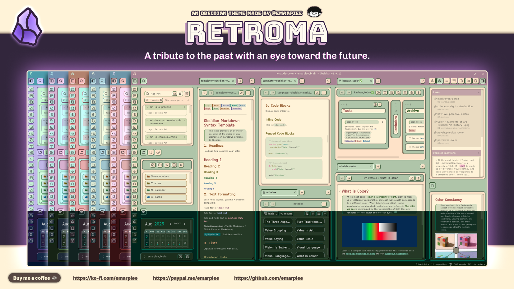
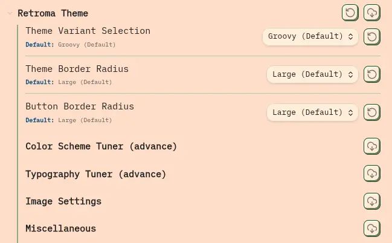
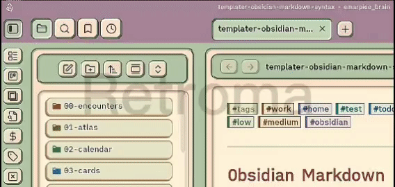

# Retroma Obsidian Theme

Your notes? Chaos. Your vault? A digital junkyard. But fear not, **Retroma** is here to trick everyone (including you) into thinking your workspace has its life together.

## 🌟 Key Features

Retroma gives you the best of both worlds, taking inspiration from classic and nostalgic designs of software and websites to create a theme that still feels professional and refined. It's a tribute to the past, reminding us of a time when buttons looked like you could actually press them and when UI actually had personality, Retroma brings that back without sacrificing usability or making your screen look like a MySpace profile circa 2006....unless you’re really determined to make it ugly.

### 🎨 Intelligent Color Scheme Algorithm

The magic starts with Retroma's advanced color algorithm so advanced, it probably has a Ph.D. in aesthetics. You pick one accent color, and Retroma's algorithm does the rest, creating a complete and harmonious palette. It’s like hiring a personal color consultant who works for free, doesn’t sleep, and never judges your questionable font choices.

### ⚙️ Extensive Customization

Think you’ve got an eye for design? Prove it. Thanks to full integration with the [Style Settings](https://github.com/mgmeyers/obsidian-style-settings) plugin, Retroma gives you near-total control. Rotate your color scheme, fine-tune folder icon saturation to match your mood, or adjust typography until it feels “just right.” No judgment here, this is your chance to show the world your inner perfectionist.

> Install the [Style Settings](https://github.com/mgmeyers/obsidian-style-settings) plugin from the community plugins to access all of Retroma's extensive customization, theme variations, and extra features.

### 🎭️ Theme Variations

I've also included three distinct variants to match your vibe:
- **Groovy:** A retro-inspired design with a focus on depth and distinct borders, ideal for those who appreciate classic aesthetics.
- **Simple:** A balanced variant that offers a clean, modern look while retaining the theme's core retro elements.
- **Minimalist:** A stripped-down version that emphasizes simplicity and clarity, focusing on essential design elements.

### ⭐️ Extra Features

- Adjustable border radius, because yes, corners are a personality trait
- Image settings (still wip...)
- Hide/show headings and footnote dividers
- Custom highlighter colors for light and dark mode, because neon yellow isn’t always the vibe
- Redesigned #tags with built-in options like:
    - #todo (spoiler: you won’t do it)
    - #home
    - #work
    - #high
    - #medium
    - #low (the tag where most tasks end up)
- …more coming soon, because I’m indecisive 😝

## 🗃️ Resources

- Font featured in the screenshots: [iA Fonts](https://github.com/iaolo/iA-Fonts?utm_source=chatgpt.com)
- ...

## 🔌 Plugin Compatibility

- [Calendar](https://github.com/liamcain/obsidian-calendar-plugin?utm_source=chatgpt.com) 🟢
- [Dataview](https://github.com/blacksmithgu/obsidian-dataview?utm_source=chatgpt.com) 🟠
- ...

---

## ⬇️ Installations

### Obsidian Community Theme

> Review in progress...

### Manual

1. **Download the Theme:** First, download the [source code](https://github.com/emarpiee/Retroma/releases) for the theme.
2. **Extract the Files:** Unzip the downloaded folder to access its contents.
3. **Find Your Themes Folder:** Navigate to your Obsidian vault. Inside, look for the **`.obsidian/themes/`** directory.
4. **Create a New Theme Folder:** Inside the `themes` directory, create a new folder and name it **`Retroma`**.
5. **Move the Theme Files:** Copy the **`theme.css`** and **`manifest.json`** files from the unzipped download and place them into the new `Retroma` folder you just created.
6. **Restart and Apply:** Close and reopen Obsidian. Go to **Settings** > **Appearance** and select **Retroma** from the theme list to activate it.

## 🌱 Contribute to the Project

We welcome contributions of all kinds! If you're interested in helping out, please follow these guidelines.

### 🐞 Found a Bug?

1. Check the [issues](https://github.com/emarpiee/Retroma/issues) to see if the bug has already been reported.
2. If not, open a new issue. Please provide a clear title and a detailed description, including steps to reproduce the bug.

### 🔖 Want a New Feature?

1. Check the [issues](https://github.com/emarpiee/Retroma/issues) to see if the feature has already been requested.
2. If not, open a new issue and describe the feature you'd like to see.

### 📈 Ready to Contribute Code?

1. Fork the repository.
2. Create a new branch for your feature or bug fix: `git checkout -b feature/your-feature-name` or `git checkout -b fix/your-bug-fix`.
3. Make your changes and test them thoroughly.
4. Commit your changes with a clear and descriptive commit message.
5. Push your branch to your forked repository.
6. Open a [pull request](https://github.com/emarpiee/Retroma/pulls) to the `main` branch of the original repository.

## 📍 Note from the Developer

Retroma is still a work in progress, a passion project born from my love of retro design and my hatred of endless customization menus. Big thanks to [@codeisconfusing](https://github.com/codeisconfusing) for the inspiration (and button code) from their [Retro Windows Obsidian Theme](https://github.com/codeisconfusing/retro-windows-obsidian).

## ☕️ Buy Me A Coffee

Donations are greatly appreciated and will be used to fund my sanity, and my cats' 😼 expensive tastes."

- https://buymeacoffee.com/emarpiee
- https://ko-fi.com/emarpiee
- https://paypal.me/emarpiee
  
